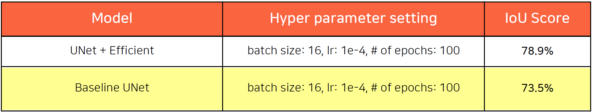
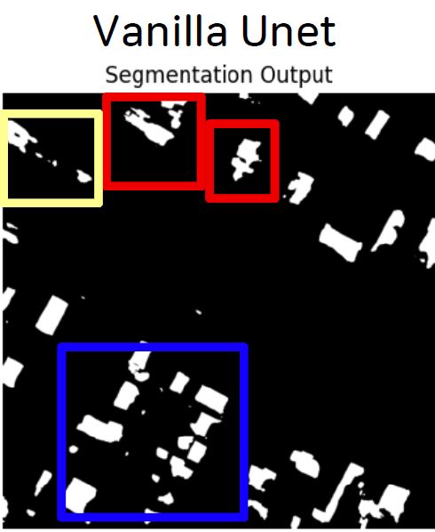
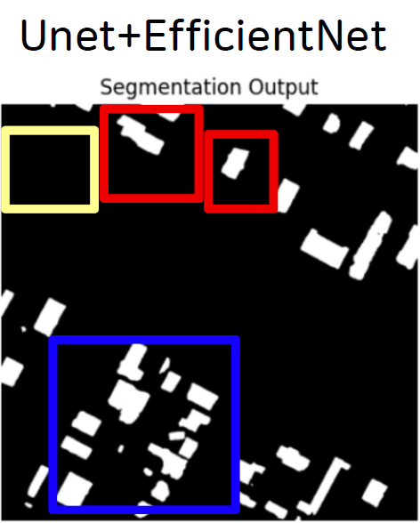

## AI project - 항공 이미지를 활용한 건물 객체 추출

### :radio_button:TEAM 3
- 팀장: 이재웅
- 팀원: 박태현 임석현 서인규 이정아 임유진

### :radio_button:Dataset
- [Inria Aerial Image Labeling Dataset](https://www.kaggle.com/datasets/huanranye/inria-aerial-image-labeling-dataset/)
  
### :radio_button:Data Preprocessing
- Gaussian Blur
- RandomBrightnessContrast

### :radio_button:Model processing
1) Baseline
  [UNet + convolution filer](https://github.com/ingyuseo/AI_project_team3/blob/main/FinalProject/code/Baseline.ipynb)
  [UNet + ResNet](https://github.com/ingyuseo/AI_project_team3/blob/main/FinalProject/code/UnetVanila_UnetResnet_Week13.ipynb)
    
2) [UNet + EfficientNet for Encoder Backbone](https://github.com/ingyuseo/AI_project_team3/blob/main/FinalProject/code/Unet_efficientnet.ipynb)

3) [Grid Search + Cross-validation](https://github.com/ingyuseo/AI_project_team3/blob/main/FinalProject/code/GridsearchCV.ipynb)
  Tuning the optimal parameters
    |lr|epoch|batch size|
    |:---:|:---:|:---:|
    |1e-3|50|32|
    |**1e-4**|**100**|**16**|
    |1e-5|200|8|

4) [UNet + ConvNext](https://github.com/ingyuseo/AI_project_team3/blob/main/FinalProject/code/Unet_ConvNext.ipynb)

5) [Swin Transformer](https://github.com/ingyuseo/AI_project_team3/blob/main/FinalProject/code/Upernet_Swin.ipynb)

### :radio_button:Performance
1) IoU performance: Baseline UNet vs. UNet + EfficientNet
   <!-- -->
    |Model|Hyper parameter setting|IoU|
    |:---:|:---:|:---:|
    |UNet + Efficient|batch size:16, lr: 1e-4, # of epochs: 100|78.9%|
    |Baseline UNet|batch size:16, lr: 1e-4, # of epochs: 100|73.5%|
   
3) Output performance: Vanilla UNet vs. UNet + EfficientNet
   
   
2) [GMAC, GFLOPS](https://github.com/ingyuseo/AI_project_team3/blob/main/FinalProject/code/Flops_Counting.ipynb)

---
[DVC google storage](https://drive.google.com/drive/folders/11Jspj2-U19l0dgJj56GoSFkup0A0qjtV)
